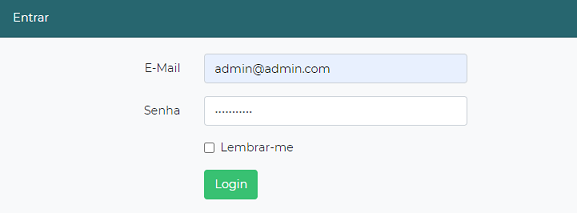
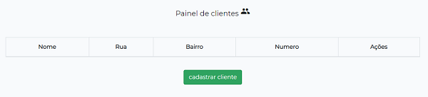
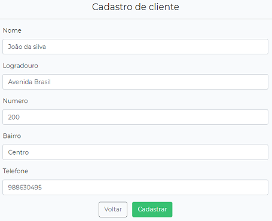
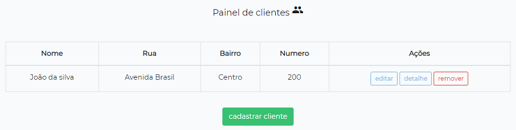
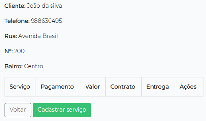
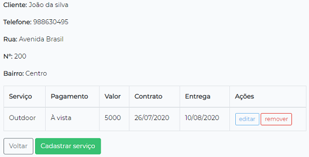

 <h1>AppCliente</h1>
    
O AppCliente é uma soluçao desenvolvida para facilitar o gerenciamento de clientes e serviços prestados por micro-empresas.
    
Por meio de um sistema simples e seguro é possível realizar o cadastro contendo todas as informações de seu cliente e do(s) serviço(s) à ele prestado. 
    Sendo assim, você tem uma base de dados online para a gestão e acompanhamento de seu negócio.
    

    <h2>Manual de utilização do software</h2>
    <h3>1. Acessando o software</h3>
    
Utilizando o navegador acesse o endereço do seu sistema.Exemplo: www.appcliente.com

    <h3>1.2 Autenticação de usuário</h3>
    
Ao acessar o sistema você será redirecionado a página de login onde fará a autenticação de usuário.

    
Informe o e-mail e a senha fornecidos pela nossa empresa para realizar o acesso.

    
    
(E-mail ilustrativo)

    <h3>2. Dashboard</h3>
    
Após efetuar o login você será redirecionado a sua Dashboard onde será informado o valor total de suas receitas do mês atual e uma tabela contendo as últimas
    receitas cadastradas no sistema.

    <h3>3. Clientes</h3>
    
Acessando: na parte superior de seu sistema acesse a barra de navegação clicando na opção <b>clientes</b>. Você será redirecionado à página princial de clientes 
    onde é retornado toda sua base de clientes cadastrados em forma de uma tabela e um botão para o cadastro de cliente.

     
    <h3>3.1 Cadastro</h3>
    
Clicando no botão <b>cadastrar cliente</b> você será redirecionado a um formulário onde todas as informações requisitadas deverão ser preenchidas, 
    e por fim clique em <b>cadastrar.</b>

    
    
Ao cadastrar um novo cliente você sera redirecionado novamente à página principal de clientes onde será mostrado apenas as principais informações de cada cliente.

    
    <h3>3.2 Edição</h3>
    
No lado direito da tabela de registros, na coluna <b>ações</b>, você terá três opções de ação sobre um registro: editar, detalhe e remover.

    
A primeira opção é a de edição de informações do cliente. Clique no botão <b>editar</b> e você será redirecionado ao mesmo formulário onde seu cliente foi 
    anteriormente cadastrado. Cada campo do formulário irá conter por padrão as informações já cadastradas, basta ir até o campo em que deseja editar e fazer a correção, 
    clicando no botão <b>atualizar</b> a edição será salva e você será novamente redirecionado para a página principal de clientes.

    <h3>3.3 Detalhe</h3>
    
Selecionando a opção <b>detalhe</b> da coluna <b>ações</b> você será redirecionado até a página de detalhe do cliente onde encontrará todas as informações cadastradas 
    e um botão com a opção de <b>cadastrar serviço</b> onde é possível cadastrar todos os serviços prestados ao cliente.

    <h3>3.4 Remover</h3>
    
Para remover algum cliente basta clicar na opção <b>remover</b> da coluna <b>ações</b> encontrada na pagina principal de clientes e confirmar a mensagem de 
    exclusão de registro.

    
<b>Atenção:</b> Ao remover qualquer cliente todos os serviços relacionados a ele serão permanentemente excluídos do sistema.

    <h3>4. Serviços</h3>
    
Acessando: na parte superior de seu sistema acesse a barra de navegação clicando na opção <b>serviços</b>. Você será redirecionado à página principal de serviços 
    onde é exibida toda sua base de serviços cadastrados.

    <h3>4.1 Cadastro</h3>
    
Para efetuar o cadastro de um ou mais serviços dirija-se à página de clientes e clique no botão <b>detalhe</b>, na coluna <b>ações</b>, do cliente desejado e você 
    será redirecionado até a pagina de detalhe do cliente onde encontrará o botão <b>cadastrar serviço</b>. 

    
    
Após clicar no botão de cadastro preencha o formulário com as devidas informações do serviço e clique em <b>cadastrar</b>.

    
Todo serviço cadastrado ficará disponível na página de detalhe do cliente e também de forma geral na página principal de serviços.

    
    <h3>4.2 Edição</h3>
    
Ainda na página de detalhe do cliente vá até a tabela de serviços na coluna <b>ações</b> e clique no botão <b>editar</b> na linha do cliente desejado e você será 
    redirecionado ao mesmo formulário onde cadastrou previamente o serviço. Cada campo do formulário irá conter por padrão as informações já cadastradas, basta ir até o
    campo em que deseja editar e fazer a correção. Clicando no botão <b>atualizar</b> a edição será salva.

    <h3>4.3 Detalhe</h3>
    
Na página de serviço clique em <b>detalhe</b>, na coluna <b>ações</b>, na linha do serviço desejado e você será redirecionado até a página de detalhe do cliente 
    onde encontrará todos os serviços prestado ao cliente em questão.

    <h3>4.4 Remover</h3>
    
Dirija-se à página de detalhe do cliente desejado e clique na opção <b>remover</b>, da coluna <b>ações</b>, na linha do serviço desejado e confirme a mensagem de 
    exclusão de serviço.

    

    <a href="https://github.com/iannkzw/AppClienteLaravel/blob/master/DIAGRAMA_BD.pdf">Diagrama</a>
    <a href="https://www.youtube.com/watch?v=3YcqqTO9keA&feature=youtu.be">Video do sistema</a>
